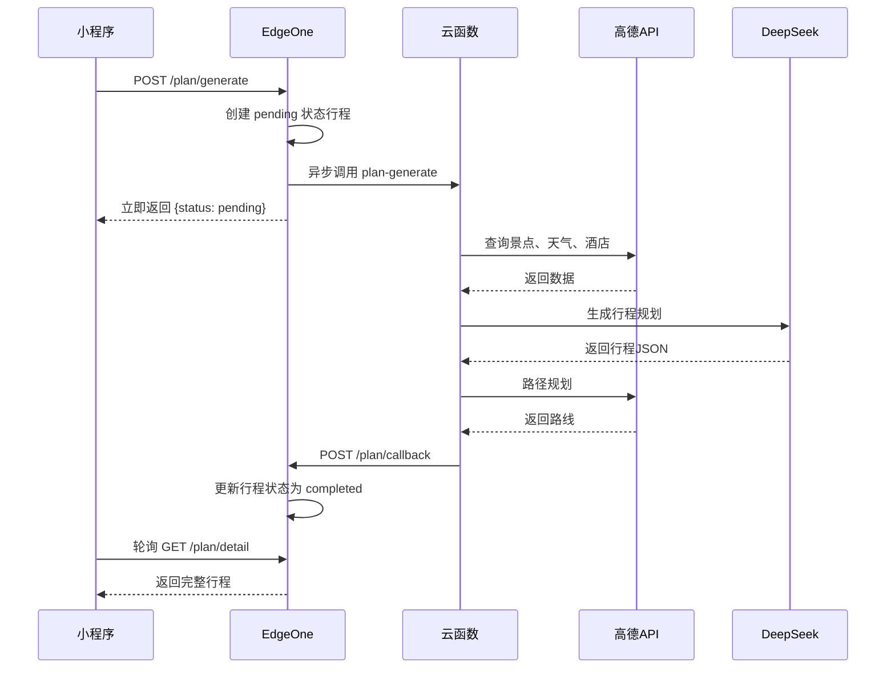
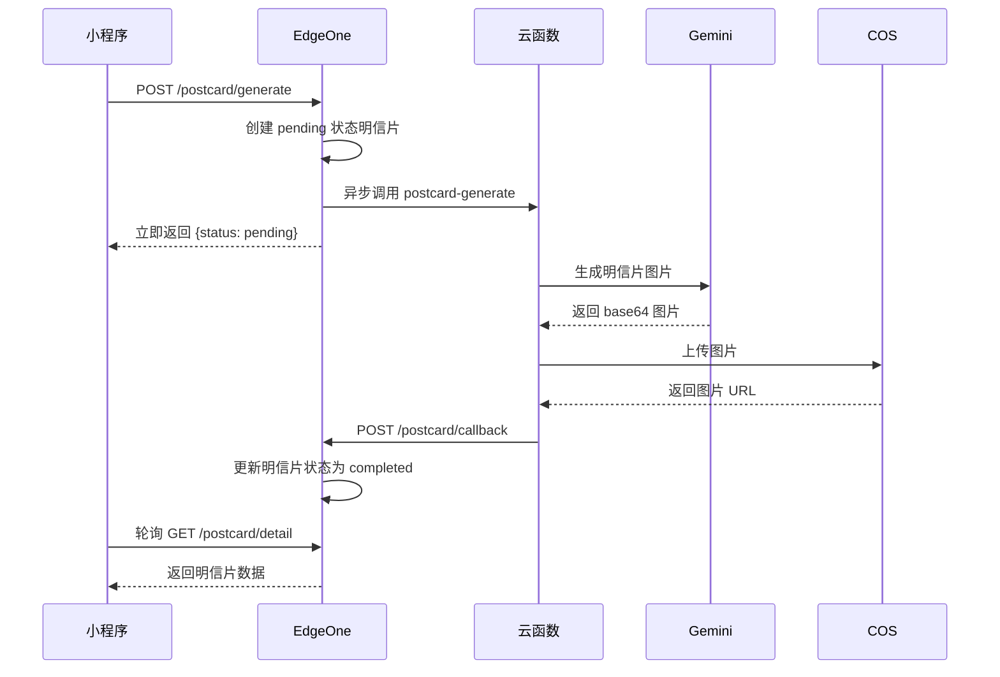

# 足迹明信片 (Footprint Postcard)


一款基于微信小程序的旅行规划与明信片生成应用。

## ✨ 功能特性

### 🗺️ 行程规划
- **一键生成行程**：输入目的地、日期、偏好，自动生成详细旅行计划
- **景点推荐**：基于高德地图 POI 搜索，推荐周边热门景点
- **天气预报**：集成实时天气数据，调整行程建议
- **住宿推荐**：根据预算和偏好推荐合适酒店
- **路线规划**：自动计算景点间的交通路线和时间

### 🖼️ 明信片生成
- **一键生成明信片**：根据行程自动生成专属明信片图片
- **精美图片**：多模态模型生成精美旅行纪念图片
- **明信片管理**：保存、浏览、删除个人明信片收藏

### 📍 位置服务
- **当前位置识别**：自动获取用户当前城市
- **周边景点发现**：展示附近热门景点和美食
- **热门目的地**：推荐热门旅行目的地

## 🏗️ 项目架构

```
footprint-postcard/
├── miniprogram/              # 微信小程序前端
│   ├── pages/                # 页面目录
│   │   ├── index/            # 首页
│   │   ├── login/            # 登录页
│   │   ├── plan/             # 创建行程页
│   │   ├── plan-list/        # 行程列表页
│   │   ├── plan-detail/      # 行程详情页
│   │   ├── postcard/         # 明信片页
│   │   ├── attractions/      # 景点列表页
│   │   ├── profile/          # 个人中心页
│   │   ├── privacy/          # 隐私政策页
│   │   └── agreement/        # 服务条款页
│   ├── components/           # 自定义组件
│   │   ├── custom-navbar/    # 自定义导航栏
│   │   └── navigation-popup/ # 导航弹窗
│   ├── utils/                # 工具类
│   │   ├── api.js            # API 请求封装
│   │   └── storage.js        # 本地存储工具
│   └── app.json              # 小程序配置
├── edgeone/                  # 腾讯云 EdgeOne Pages Functions
│   ├── functions/api/        # API 函数目录
│   │   └── [[path]].js       # 捕获所有 /api/* 请求
│   └── config/               # 配置目录
├── tencentcloud-scf/         # 腾讯云函数 (异步处理)
│   ├── plan-generate/        # 行程规划生成云函数
│   │   ├── index.js          # 行程规划逻辑
│   │   └── package.json      # 依赖配置
│   ├── postcard-generate/    # 明信片生成云函数
│   │   ├── index.js          # 明信片生成逻辑
│   │   └── package.json      # 依赖配置
│   └── README.md             # 云函数部署文档
├── workers/                  # Cloudflare Workers (备选方案)
│   ├── api.js                # API 主入口
│   └── wrangler.toml         # Wrangler 配置
└── n8n-workflows/            # N8N 自动化工作流 (备选方案)
    └── 智能旅行规划工作流.json
```

## 🛠️ 技术栈

### 前端
- **微信小程序原生框架**
- **WXML + WXSS + JavaScript**
- **自定义组件化开发**
- **腾讯地图组件**

### 后端（主推架构）
- **腾讯云 EdgeOne Pages Functions** - 边缘计算 API 服务
- **腾讯云 KV** - 用户数据存储
- **腾讯云 COS** - 图片文件存储
- **腾讯云函数 SCF** - 异步任务处理
  - `plan-generate`: 行程规划生成服务
  - `postcard-generate`: 明信片图片生成服务

### 第三方服务
- **DeepSeek** - 大语言模型（行程规划）
- **Gemini 3 Pro Image Preview** - 多模态模型（明信片图片生成，通过 kuai.host 代理）
- **高德地图 API** - 地理位置、POI 搜索、天气服务、路线规划

## 📡 API 接口

### 用户相关
| 接口 | 方法 | 说明 |
|------|------|------|
| `/user/login` | POST | 微信登录，获取 JWT Token |

### 地图相关
| 接口 | 方法 | 说明 |
|------|------|------|
| `/location/city` | GET | 根据坐标获取城市信息 |
| `/destinations/hot` | GET | 获取热门目的地 |
| `/attractions/nearby` | GET | 获取周边景点 |

### 行程相关
| 接口 | 方法 | 说明 |
|------|------|------|
| `/plan/generate` | POST | 生成行程计划（异步，立即返回 pending 状态） |
| `/plan/list` | GET | 获取行程列表（分页） |
| `/plan/detail` | GET | 获取行程详情（支持按天加载） |
| `/plan/delete` | DELETE | 删除行程 |
| `/plan/callback` | POST | 云函数回调接口（内部使用） |

### 明信片相关
| 接口 | 方法 | 说明 |
|------|------|------|
| `/postcard/generate` | POST | 生成明信片（异步，立即返回 pending 状态） |
| `/postcard/list` | GET | 获取明信片列表（分页） |
| `/postcard/detail` | GET | 获取明信片详情 |
| `/postcard/delete` | DELETE | 删除明信片 |
| `/postcard/callback` | POST | 云函数回调接口（内部使用） |

### 路线规划
| 接口 | 方法 | 说明 |
|------|------|------|
| `/route/driving` | GET | 驾车路径规划 |
| `/route/walking` | GET | 步行路径规划 |
| `/route/transit` | GET | 公交路径规划 |
| `/route/day-path` | GET | 获取当天全程路径（支持缓存） |

### 工具接口
| 接口 | 方法 | 说明 |
|------|------|------|
| `/upload/image` | POST | 上传图片 |
| `/proxy/image` | GET | 图片代理（解决域名限制） |

## 🔧 环境配置

### EdgeOne Pages Functions 环境变量

在腾讯云 EdgeOne 控制台设置以下环境变量：

| 变量名 | 说明 |
|--------|------|
| `JWT_SECRET` | JWT 签名密钥 |
| `WECHAT_APP_ID` | 微信小程序 AppID |
| `WECHAT_APP_SECRET` | 微信小程序 AppSecret |
| `AMAP_KEY` | 高德地图 Web 服务 API Key |
| `DEEPSEEK_API_KEY` | DeepSeek API Key（用于行程规划） |
| `KUAI_API_KEY` | kuai.host API Key（Gemini 代理） |
| `KUAI_API_BASE` | kuai.host API Base URL（默认 `https://api.kuai.host`） |
| `KUAI_MODEL` | kuai.host 模型名称（默认 `gemini-3-pro-image-preview`） |
| `COS_SECRET_ID` | 腾讯云 COS Secret ID |
| `COS_SECRET_KEY` | 腾讯云 COS Secret Key |
| `COS_BUCKET` | COS 存储桶名称 |
| `COS_REGION` | COS 区域（如 `ap-guangzhou`） |
| `COS_DOMAIN` | COS 自定义域名（可选） |
| `POSTCARD_SERVICE_URL` | 明信片生成云函数 URL |
| `PLAN_SERVICE_URL` | 行程规划生成云函数 URL |

### 腾讯云函数配置

#### plan-generate 云函数环境变量
| 变量名 | 说明 |
|--------|------|
| `AI_API_KEY` | DeepSeek API Key（可选，EdgeOne会传递） |

#### postcard-generate 云函数环境变量
无需额外配置，所有参数由 EdgeOne 传递。

### KV 命名空间

在 EdgeOne 控制台绑定 KV 命名空间：
- **绑定名称**: `KV`
- **命名空间 ID**: 在腾讯云 KV 控制台创建

## 🚀 部署指南

### 1. 部署腾讯云函数

#### 1.1 创建明信片生成云函数

1. 登录 [腾讯云云函数控制台](https://console.cloud.tencent.com/scf)
2. 点击 **"新建"** → **"从头开始"**
3. 填写基本信息：
   - **函数名称**: `footprint-postcard-generate`
   - **地域**: 广州（或选择靠近你的地域）
   - **运行环境**: `Node.js 18.x`
   - **函数类型**: **事件函数**
4. 函数代码：
   - 选择 **"在线编辑"**
   - 复制 `tencentcloud-scf/postcard-generate/index.js` 的全部内容
   - 粘贴到在线代码编辑器
5. 高级配置：
   - **执行方法**: `index.main_handler`
   - **执行超时时间**: `900` 秒
   - **内存**: `512` MB
6. 点击 **"完成"**
7. 配置公网访问（**函数 URL** 方式推荐）：
   - 点击 **"触发管理"** 标签
   - 启用 **"函数 URL"**，选择 **"免鉴权"**
   - 复制生成的 URL（保存到 EdgeOne 环境变量 `POSTCARD_SERVICE_URL`）

#### 1.2 创建行程规划生成云函数

1. 重复上述步骤
2. 函数名称改为: `footprint-plan-generate`
3. 复制粘贴 `tencentcloud-scf/plan-generate/index.js` 的内容
4. 其他配置相同

### 2. 部署 EdgeOne Pages Functions

1. 登录 [腾讯云 EdgeOne 控制台](https://console.cloud.tencent.com/edgeone)
2. 创建或选择已有站点
3. 进入 **"Pages"** → **"Functions"**
4. 上传 `edgeone/` 目录内容
5. 配置环境变量（参考上方环境配置章节）
6. 绑定 KV 命名空间
7. 部署并获取访问域名

### 3. 微信小程序配置

1. 在微信公众平台注册小程序
2. 配置服务器域名白名单：
   - EdgeOne 域名（如 `https://fp.smallyoung.cn`）
   - `https://restapi.amap.com`
3. 修改 `miniprogram/utils/api.js` 中的 `BASE_URL` 为 EdgeOne 域名
4. 使用微信开发者工具上传代码

## 🔄 异步处理流程

本项目采用 **EdgeOne + 云函数** 异步解耦架构，避免 API 超时问题：

### 行程规划生成流程



### 明信片生成流程



## 💡 核心技术亮点

### 1. 边缘计算 + 云函数异步解耦

- **EdgeOne Pages Functions**: 全球边缘节点部署，快速响应用户请求
- **腾讯云函数 SCF**: 异步处理长任务（AI 生成、路径规划），避免超时
- **回调机制**: 云函数完成后主动回调 EdgeOne 更新状态，保证数据一致性

### 2. 高德地图深度集成

- **8 项 Web 服务 API**: 逆地理编码、POI 搜索、天气查询、路径规划等
- **多模式路径规划**: 支持驾车、步行、公交三种出行方式
- **智能路线优化**: 自动选择最优交通方式，避免不合理远距离

### 3. AI 驱动的智能规划

- **DeepSeek 大模型**: 根据景点、天气、酒店数据生成个性化行程
- **Gemini 多模态模型**: 生成手绘风格旅行明信片
- **结构化输出**: AI 生成标准 JSON 格式，确保数据可靠性

## 📝 备选架构说明

本项目同时提供 **Cloudflare Workers + N8N** 架构方案（见 `workers/` 和 `n8n-workflows/` 目录），适用于需要全球部署或已有 Cloudflare 基础设施的场景。两种架构在业务逻辑上完全一致，可根据实际需求选择使用。

## 📄 License

MIT License

## 🤝 贡献

欢迎提交 Issue 和 Pull Request！
